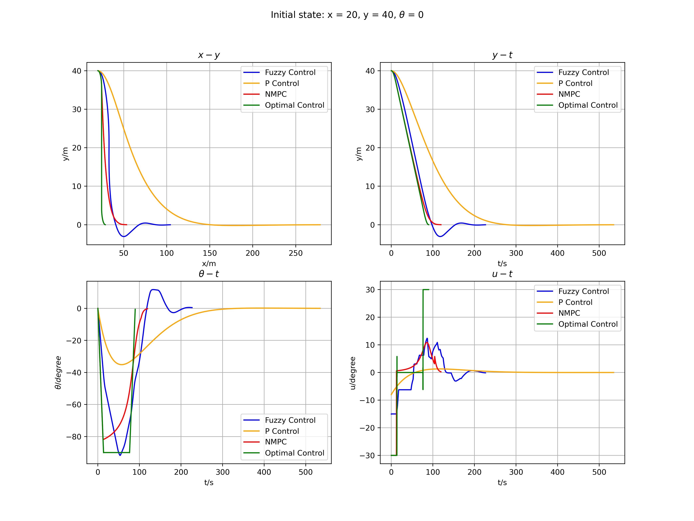
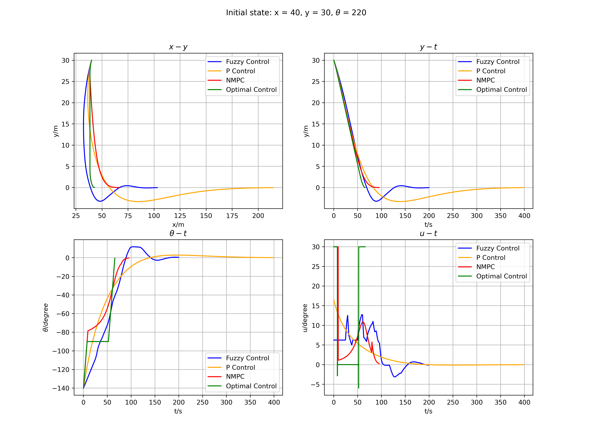

# EE7207 MINI PROJECT

Student name: [Chen Tairan](mailto:tchen008@e.ntu.edu.sg)

Matric number: G2101544C

Source code: [https://github.com/chentairan/EE7207_CA2](https://github.com/chentairan/EE7207_CA2)

## Abstract

This report shows the solution process and experimental results of two problems of fuzzy control and clustering with theoretical analysis. **In the fuzzy control problem**, the given fuzzy system is firstly modeled and the simulation environment is constructed to simulate the fuzzy control under four initial conditions. Secondly, a classical model predictive controller is designed and implemented. Then an optimal controller in this environment is explored and compared with the fuzzy logic controller. **In the clustering problem**, firstly the fuzzy tolerance relation $R_{1}$ and fuzzy equivalence relation $R$ are calculated separately using the definition in the question. After that, $\alpha$-cut $R_{\alpha}$ are calculated when the $\alpha$-cut levels are 0.4 and 0.8, respectively, and the corresponding classification classes are found. Finally, the appropriate $\alpha$-cut value range to classify the flooding for the whole country into 3 classes is given.

## I. Fuzzy Control

In this part, I implement fuzzy controller, model predictive controller and optimal controller and make an analysis of the control performance of all three.

### A. Design and simulation of fuzzy logic controller

I construct the fuzzy system by **Python** according to the variable ranges, membership functions and fuzzy rules given in the question. Member functions are composed of **trapezoidal** and **triangular** functions. Afterwards, according to the defuzzification **Equation 1.1** given in the question, the output action $u$ is obtained.
$$
\tag{1.1} 
u_{COG}=\frac{\int \limits_{U} u_{i}\mu_{U_{i}}(u_{i})du_{i} }{\int \limits_{U} \mu_{U_{i}}(u_{i})du_{i}}
$$
Based on the fuzzy rule, I draw the **control space** of fuzzy system shown in Fig. 1.1.

Fig. 1.1 Control space of the fuzzy system

More implementation details can be found in the source code: [fuzzy.py](https://github.com/chentairan/EE7207_CA2/blob/master/fuzzy.py)

The simulation environment is built in **Python** with the vehicle model **Equation 1.2**.
$$
\tag{1.2}
\theta(k+1) = \theta(k)+vTtan(u(k))/L\\
x(k+1) = x(k) + vTcos(\theta(k))\\
y(k+1) = y(k) + vTsin(\theta(k))
$$
More implementation details can be found in the source code: [model.py](https://github.com/chentairan/EE7207_CA2/blob/master/model.py)

### B. Classical Model Predictive Control

In this subsection, I design mpc to accomplish this control task. The problem is defined as shown in **Equation 1.3**.
$$
\tag{1.3}
\mathop{minimize}\limits_{u_1,u_2,...,u_N, x_1,x_2,...,x_{N+1}} q_1(y_N^2+\theta_N^2)+q_2\sum_{k=0}^{N-1} y_k^{2} + \theta_k^2\\
subject \; to \quad \bold{x_{k+1}} = F(\bold{x_k}, u_k) \quad k=0...N,\\
\bold{x_0}=init\_state\\
u_0 = init\_steering\\
-100 \leq y \leq 100\\
-\pi \leq \theta \leq \pi\\
-\frac{\pi}{6} \leq u \leq \frac{\pi}{6}
$$
Where $\bold{x_k} = [x_k,y_k,\theta_k]$ represents the car state at time step $k$ , $u_k$ is steering angle at time step $k$, $F(\bold{x_k}, u_k)$ is the car model.

I define and solve the problem by $$Casadi^{[1]}$$, where I try the case of N=10.

More implementation details can be found in the source code: [mpc.py](https://github.com/chentairan/EE7207_CA2/blob/master/mpc.py)

### C. Optimal Control

Further I explore the optimal solution of this control task, so I define the following problem as shown in Equation 1.4.
$$
\tag{1.4}
\mathop{minimize}\limits_{u_1,u_2,...,u_N, x_1,x_2,...,x_{N+1}} T\\
subject \; to \quad \bold{x_{k+1}} = F(\bold{x_k}, u_k, dt) \quad k=0...N,\\
\bold{x_0}=init\_state\\
u_0 = init\_steering\\
y_N^2 \leq y\_tolerance\\
\theta_N^2 \leq \theta\_tolerance \\
0 \leq T \\
dt = \frac{T}{N}\\
-100 \leq y \leq 100\\
-\pi \leq \theta \leq \pi\\
-\frac{\pi}{6} \leq u \leq \frac{\pi}{6}
$$
By minimizing the time $T$, the optimal vehicle steering angles to accomplish this control task can be solved. Where $y\_tolerance$ and $\theta\_tolerance$ are the end conditions for completing the task. I set these two values to $10^{-4}$. In addition RK4 is used to integrate the model to get more accurate results.

More implementation details can be found in the source code: [opt.py](https://github.com/chentairan/EE7207_CA2/blob/master/opt.py)

### D. Experiment

In this subsection, the results of three different controller with different initial states are shown in Fig 1.2-5.

Fig. 1.2 Initial state 1, top-left: x-y, top-right: y-t, bottom-left: &theta;-t, bottom-right: u-t

Fig. 1.3 Initial state 2, top-left: x-y, top-right: y-t, bottom-left: &theta;-t, bottom-right: u-t

Fig. 1.4 Initial state 3, top-left: x-y, top-right: y-t, bottom-left: &theta;-t, bottom-right: u-t

Fig. 1.5 Initial state 4, top-left: x-y, top-right: y-t, bottom-left: &theta;-t, bottom-right: u-t

In these figures, it can be seen that **Fuzzy Control** continues down/up after reaching y=0 and thus there is **overshoot** in fuzzy control. But **NMPC** and **Optimal Control** do **not have overshoot** phenomena. This is because NMPC and Optimal Control include the **vehicle's motion model**, which allows for better prediction for the next control. The **horizon** of Optimal Control is **infinite**, while NMPC has only a finite number $N$, which causes the convergence performance of NMPC to be worse than that of Optimal Control but better than that of Fuzzy Control. Since the objective function of the Optimal Control is overall time $T$, it is the fastest to reach the parking station.

More implementation details can be found in the source code: [metrics.py](https://github.com/chentairan/EE7207_CA2/blob/master/metrics.py)

## II. Clustering

### A. Calculation of fuzzy tolerance relation $R_{1}$

Follow the step in the question2, I calculate the $R_1$ based on cosine amplitude method.

The $R_1$ is shown in **Equation 2.1**. 
$$
\tag{2.1} 
R_1 =
\begin{bmatrix}
1.00&0.87&0.51&0.25&0.26&0.53&0.27&0.54&0.78&0.86&0.47&0.92&0.12&0.97&0.98&0.87\\
0.87&1.00&0.53&0.09&0.49&0.39&0.44&0.31&0.65&0.63&0.39&0.98&0.21&0.76&0.78&0.80\\
0.51&0.53&1.00&0.51&0.84&0.84&0.64&0.61&0.82&0.72&0.97&0.58&0.91&0.64&0.58&0.86\\
0.25&0.09&0.51&1.00&0.57&0.17&0.78&0.94&0.17&0.31&0.67&0.25&0.41&0.44&0.27&0.51\\
0.26&0.49&0.84&0.57&1.00&0.43&0.90&0.53&0.42&0.30&0.78&0.50&0.83&0.34&0.24&0.65\\
0.53&0.39&0.84&0.17&0.43&1.00&0.13&0.37&0.94&0.86&0.81&0.43&0.75&0.64&0.65&0.73\\
0.27&0.44&0.64&0.78&0.90&0.13&1.00&0.71&0.19&0.18&0.65&0.50&0.56&0.36&0.21&0.58\\
0.54&0.31&0.61&0.94&0.53&0.37&0.71&1.00&0.43&0.59&0.75&0.48&0.40&0.71&0.57&0.72\\
0.78&0.65&0.82&0.17&0.42&0.94&0.19&0.43&1.00&0.96&0.76&0.69&0.60&0.83&0.86&0.87\\
0.86&0.63&0.72&0.31&0.30&0.86&0.18&0.59&0.96&1.00&0.73&0.71&0.44&0.93&0.94&0.89\\
0.47&0.39&0.97&0.67&0.78&0.81&0.65&0.75&0.76&0.73&1.00&0.48&0.88&0.65&0.56&0.83\\
0.92&0.98&0.58&0.25&0.50&0.43&0.50&0.48&0.69&0.71&0.48&1.00&0.23&0.86&0.86&0.87\\
0.12&0.21&0.91&0.41&0.83&0.75&0.56&0.40&0.60&0.44&0.88&0.23&1.00&0.28&0.21&0.57\\
0.97&0.76&0.64&0.44&0.34&0.64&0.36&0.71&0.83&0.93&0.65&0.86&0.28&1.00&0.98&0.93\\
0.98&0.78&0.58&0.27&0.24&0.65&0.21&0.57&0.86&0.94&0.56&0.86&0.21&0.98&1.00&0.89\\
0.87&0.80&0.86&0.51&0.65&0.73&0.58&0.72&0.87&0.89&0.83&0.87&0.57&0.93&0.89&1.00\\
\end{bmatrix}
$$

### B. Calculation of fuzzy equivalence relation $R$

Follow the **Algorithm 2.1** in question 2, the $R_2$ is shown in **Equation 2.2**.
$$
\tag{2.2} 
R =
\begin{bmatrix}
1.00&0.92&0.86&0.78&0.84&0.94&0.84&0.78&0.94&0.94&0.86&0.92&0.86&0.98&0.98&0.93\\
0.92&1.00&0.86&0.78&0.84&0.92&0.84&0.78&0.92&0.92&0.86&0.98&0.86&0.92&0.92&0.92\\
0.86&0.86&1.00&0.78&0.84&0.86&0.84&0.78&0.86&0.86&0.97&0.86&0.91&0.86&0.86&0.86\\
0.78&0.78&0.78&1.00&0.78&0.78&0.78&0.94&0.78&0.78&0.78&0.78&0.78&0.78&0.78&0.78\\
0.84&0.84&0.84&0.78&1.00&0.84&0.90&0.78&0.84&0.84&0.84&0.84&0.84&0.84&0.84&0.84\\
0.94&0.92&0.86&0.78&0.84&1.00&0.84&0.78&0.94&0.94&0.86&0.92&0.86&0.94&0.94&0.93\\
0.84&0.84&0.84&0.78&0.90&0.84&1.00&0.78&0.84&0.84&0.84&0.84&0.84&0.84&0.84&0.84\\
0.78&0.78&0.78&0.94&0.78&0.78&0.78&1.00&0.78&0.78&0.78&0.78&0.78&0.78&0.78&0.78\\
0.94&0.92&0.86&0.78&0.84&0.94&0.84&0.78&1.00&0.96&0.86&0.92&0.86&0.94&0.94&0.93\\
0.94&0.92&0.86&0.78&0.84&0.94&0.84&0.78&0.96&1.00&0.86&0.92&0.86&0.94&0.94&0.93\\
0.86&0.86&0.97&0.78&0.84&0.86&0.84&0.78&0.86&0.86&1.00&0.86&0.91&0.86&0.86&0.86\\
0.92&0.98&0.86&0.78&0.84&0.92&0.84&0.78&0.92&0.92&0.86&1.00&0.86&0.92&0.92&0.92\\
0.86&0.86&0.91&0.78&0.84&0.86&0.84&0.78&0.86&0.86&0.91&0.86&1.00&0.86&0.86&0.86\\
0.98&0.92&0.86&0.78&0.84&0.94&0.84&0.78&0.94&0.94&0.86&0.92&0.86&1.00&0.98&0.93\\
0.98&0.92&0.86&0.78&0.84&0.94&0.84&0.78&0.94&0.94&0.86&0.92&0.86&0.98&1.00&0.93\\
0.93&0.92&0.86&0.78&0.84&0.93&0.84&0.78&0.93&0.93&0.86&0.92&0.86&0.93&0.93&1.00\\
\end{bmatrix}
$$

### C. Classification classes for $\alpha$-cut level = 0.4 and 0.8

Perform $\alpha$-cut level 0.4 and 0.8 respectively, I get the matrix $R_{\alpha-cut = 0.4}$ and $R_{\alpha-cut = 0.8}$ shown in **Equation 2.3** and **Equation 2.4**.
$$
\tag{2.3} 
R_{\alpha-cut=0.4} =
\begin{bmatrix}
1&1&1&1&1&1&1&1&1&1&1&1&1&1&1&1\\
1&1&1&1&1&1&1&1&1&1&1&1&1&1&1&1\\
1&1&1&1&1&1&1&1&1&1&1&1&1&1&1&1\\
1&1&1&1&1&1&1&1&1&1&1&1&1&1&1&1\\
1&1&1&1&1&1&1&1&1&1&1&1&1&1&1&1\\
1&1&1&1&1&1&1&1&1&1&1&1&1&1&1&1\\
1&1&1&1&1&1&1&1&1&1&1&1&1&1&1&1\\
1&1&1&1&1&1&1&1&1&1&1&1&1&1&1&1\\
1&1&1&1&1&1&1&1&1&1&1&1&1&1&1&1\\
1&1&1&1&1&1&1&1&1&1&1&1&1&1&1&1\\
1&1&1&1&1&1&1&1&1&1&1&1&1&1&1&1\\
1&1&1&1&1&1&1&1&1&1&1&1&1&1&1&1\\
1&1&1&1&1&1&1&1&1&1&1&1&1&1&1&1\\
1&1&1&1&1&1&1&1&1&1&1&1&1&1&1&1\\
1&1&1&1&1&1&1&1&1&1&1&1&1&1&1&1\\
1&1&1&1&1&1&1&1&1&1&1&1&1&1&1&1\\
\end{bmatrix}
$$

$$
\tag{2.4} 
R_{\alpha-cut=0.8} =
\begin{bmatrix}
1&1&1&0&1&1&1&0&1&1&1&1&1&1&1&1\\
1&1&1&0&1&1&1&0&1&1&1&1&1&1&1&1\\
1&1&1&0&1&1&1&0&1&1&1&1&1&1&1&1\\
0&0&0&1&0&0&0&1&0&0&0&0&0&0&0&0\\
1&1&1&0&1&1&1&0&1&1&1&1&1&1&1&1\\
1&1&1&0&1&1&1&0&1&1&1&1&1&1&1&1\\
1&1&1&0&1&1&1&0&1&1&1&1&1&1&1&1\\
0&0&0&1&0&0&0&1&0&0&0&0&0&0&0&0\\
1&1&1&0&1&1&1&0&1&1&1&1&1&1&1&1\\
1&1&1&0&1&1&1&0&1&1&1&1&1&1&1&1\\
1&1&1&0&1&1&1&0&1&1&1&1&1&1&1&1\\
1&1&1&0&1&1&1&0&1&1&1&1&1&1&1&1\\
1&1&1&0&1&1&1&0&1&1&1&1&1&1&1&1\\
1&1&1&0&1&1&1&0&1&1&1&1&1&1&1&1\\
1&1&1&0&1&1&1&0&1&1&1&1&1&1&1&1\\
1&1&1&0&1&1&1&0&1&1&1&1&1&1&1&1\\
\end{bmatrix}
$$

We can see that the clustering of the two data points according to the α level is as shown in Table 2.1.

Table 2.1 Classification results of &alpha;-cut level = 0.4 and 0.8

| $\alpha-$cut  level |                    Classification Results                    |
| :-----------------: | :----------------------------------------------------------: |
|         0.4         | $\{x_{0}, x_{1}, x_{2}, x_{3}, x_{4}, x_{5}, x_{6}, x_{7}, x_{8}, x_{9}, x_{10}, x_{11}, x_{12}, x_{13}, x_{14}, x_{15}\}$ |
|         0.8         | $\{x_{0}, x_{1}, x_{2}, x_{4}, x_{5}, x_{6}, x_{8}, x_{9}, x_{10}, x_{11}, x_{12}, x_{13}, x_{14}, x_{15} \}, \{x_{3}, x_{7} \}$ |

### D. Range of $\alpha$-cut value to classify the flooding data into 3 classes

By using the rules of classification, we can know the number of classifications corresponding to each $\alpha$-cut level. Searching from the whole range of [0, 1], I find the range of $\alpha$-cut level is [0.8426648502143806, 0.8571428602871292]

**Note that due to the horizontal space limitation of the pdf, the values of the $R$ matrix are kept to two decimal places**

More implementation details can be found in the source code: [clustering.py](https://github.com/chentairan/EE7207_CA2/blob/master/clustering.py)

## Reference

[1]  Joel A E Andersson, Joris Gillis. "CasADi: A software framework for nonlinear optimization and  optimal control". Mathematical Programming Computation. 2019
